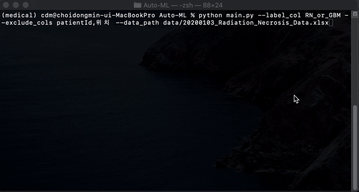

# Auto-ML for Radiomics Analysis



## Getting Started
This repository provides everything necessary to train and evaluate machine learning models on radiomics feature data.\
Note that this code may have a lot of things to be changed or developed. We welcome your feedback or append a new issue in this repo.

#### Requirements (pip install -r requirements.txt)
- Python 3 (code has been tested on Python 3.7.5)
- Python pacakges : pandas, seaborn, scikit-learn (0.22), xgboost (0.90), lightgbm (2.3.1), imblearn, scipy (1.3.1)

#### Structure
- ```options/```: argument parser options and hyper-parameter search grid setting
- ```utils/```: pre-processing, feature selection, performance calculation, and core (training and evaluation) codes
- ```main.py/```: code for model training and evaluation

#### How to Run
- To run Auto-ML on your dataset, call:\
```python main.py --data_path data.csv --label_col label_column_name --exclude_cols column_names_not_to_use```\
(Check additional argument by calling ```python main.py -h```)

#### Additional options
- If you want to control the hyper-parameter search space, change the dictionary values of ```options/search_grid.py```
- If you want to add another machine learning model, you have to do two steps.\
 i. Add machine learning model in ```model_initialization``` function on ```utils.core.py```\
 ii. Add corresponding hyper-parameter search grid in ```options/search_grid.py```


## To do list
- [ ] Export training and validation result automatically
- [ ] Make possible to control train-valid split option for divided dataset
- [ ] Code refactoring and modularization
